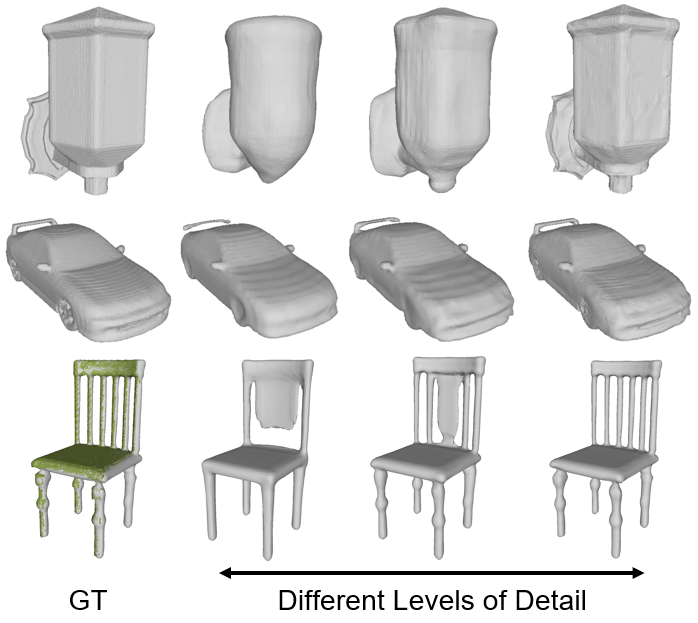
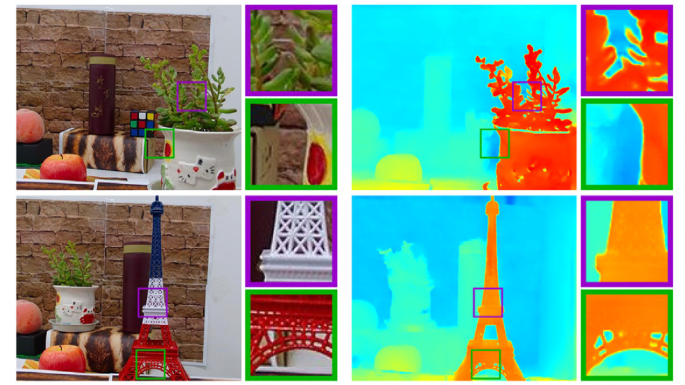
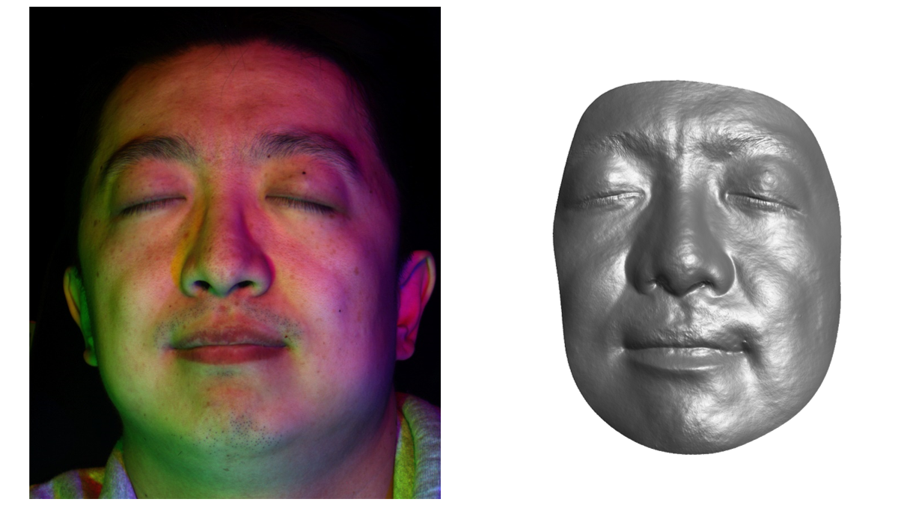
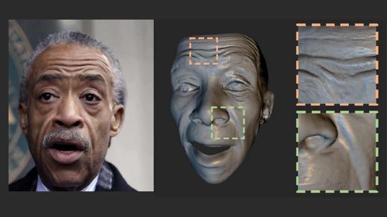
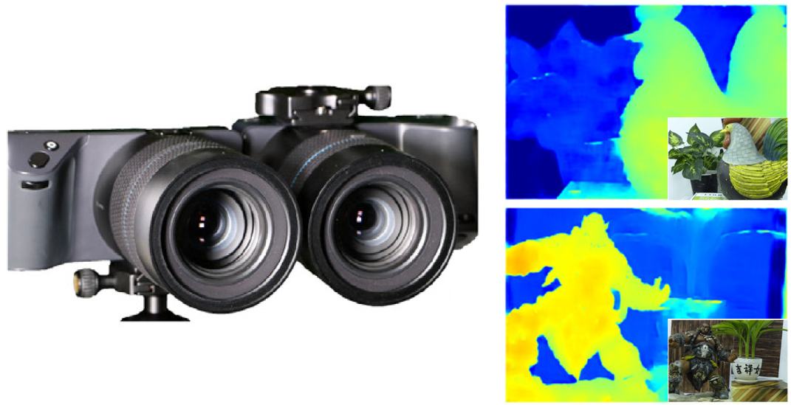
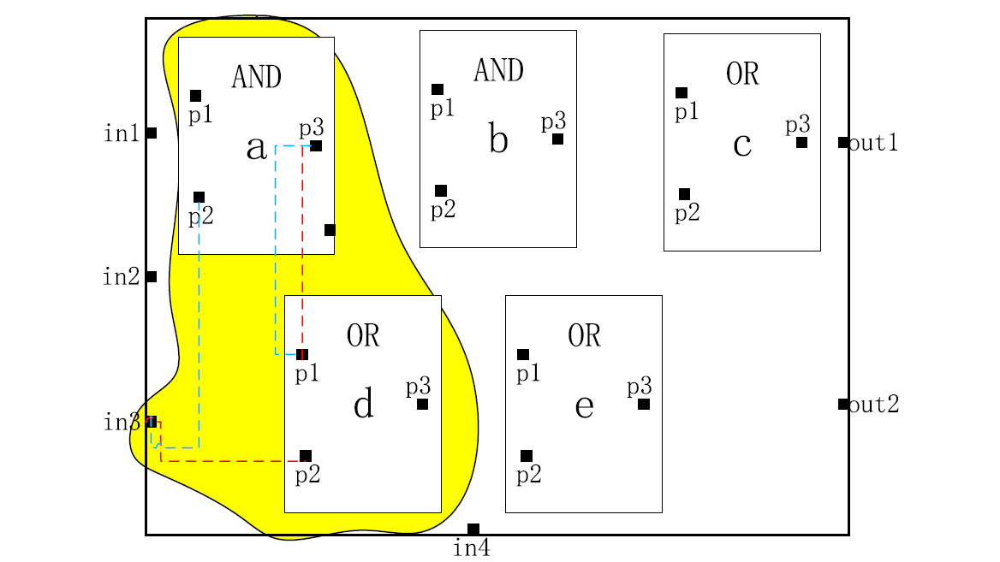
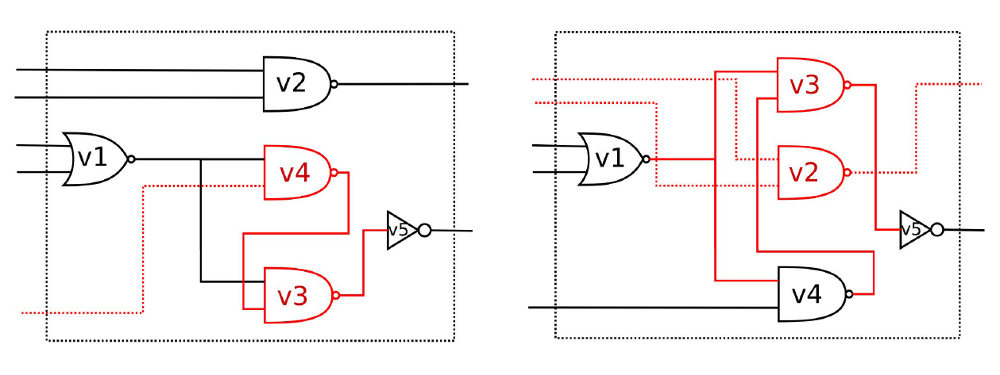

<!-- <link href="../assets/css/bootstrap.min.css" rel="stylesheet"> -->
<link href="../assets/css/bootstrap_custom.css" rel="stylesheet">

I am currently a visiting scholar at [Louisiana State University](https://www.lsu.edu/), advised by [Prof. Jinwei Ye](https://www.lsu.edu/eng/cse/people/faculty/ye.php). I received my Ph.D. degree from [ShanghaiTech University](https://www.shanghaitech.edu.cn/eng/), advised by [Prof. Jingyi Yu](https://vic.shanghaitech.edu.cn/vrvc/en/people/jingyi-yu/). Before that, I received my Bachelor degree from [Shanghai Jiao Tong University](https://en.sjtu.edu.cn/). My research interests lie in computer vision, computer graphics and computational photography, with a focus on 3D reconstruction and neural rendering.

Publications
------

    

        <video width="100%" playsinline="" autoplay="" loop="" preload="" muted="">
            <source src="../images/sofgan.mp4" type="video/mp4">
        </video>
    

    

        

            SofGAN: A Portrait Image Generator with Dynamic Styling
        

        

            TOG 2022 (Present at SIGGRAPH 2022)
        

        

            Anpei Chen*, Ruiyang Liu*, Ling Xie, <u>Zhang Chen</u>, Hao Su, Jingyi Yu
        

        

            <a href="https://apchenstu.github.io/sofgan/">[project page]</a>
            <a href="https://arxiv.org/abs/2007.03780">[paper]</a>
            <a href="https://github.com/apchenstu/sofgan">[code]</a>
        

    

    

        
    

    

        

            Multiresolution Deep Implicit Functions for 3D Shape Representation
        

        

            ICCV 2021
        

        

            <u>Zhang Chen</u>, Yinda Zhang, Kyle Genova, Sean Fanello, Sofien Bouaziz, Christian Haene, Ruofei Du, Cem Keskin, Thomas Funkhouser, Danhang Tang
        

        

            <a href="https://arxiv.org/abs/2109.05591">[paper]</a>
        

    

    

        
    

    

        

            Deep Eyes: Joint Depth Inference Using Monocular and Binocular Cues
        

        

            Neurocomputing 2021
        

        

            <u>Zhang Chen</u>*, Xinqing Guo*, Siyuan Li, Yang Yang, Jingyi Yu
        

        

            <a href="https://www.sciencedirect.com/science/article/abs/pii/S0925231220313746">[paper]</a>
            <a href="https://github.com/LansburyCH/Binocular-Focal-Stack">[data]</a>
        

    

    

        <video width="100%" playsinline="" autoplay="" loop="" preload="" muted="">
            <source src="../images/rnr.mp4" type="video/mp4">
        </video>
    

    

        

            A Neural Rendering Framework for Free-Viewpoint Relighting
        

        

            CVPR 2020
        

        

            <u>Zhang Chen</u>, Anpei Chen, Guli Zhang, Chengyuan Wang, Yu Ji, Kiriakos N. Kutulakos, Jingyi Yu
        

        

            <a href="https://arxiv.org/abs/1911.11530">[paper]</a>
            <a href="https://github.com/LansburyCH/relightable-nr">[code]</a>
        

    

    

        
    

    

        

            3D Face Reconstruction Using Color Photometric Stereo with Uncalibrated Near Point Lights
        

        

            ICCP 2020
        

        

            <u>Zhang Chen</u>, Yu Ji, Mingyuan Zhou, Sing Bing Kang, Jingyi Yu
        

        

            <a href="https://arxiv.org/abs/1904.02605">[paper]</a>
        

    

    

        
    

    

        

            Photo-Realistic Facial Details Synthesis From Single Image
        

        

            ICCV 2019 (Oral)
        

        

            Anpei Chen, <u>Zhang Chen</u>, Guli Zhang, Ziheng Zhang, Kenny Mitchell, Jingyi Yu
        

        

            <a href="https://apchenstu.github.io/facial_details/">[project page]</a>
            <a href="https://openaccess.thecvf.com/content_ICCV_2019/html/Chen_Photo-Realistic_Facial_Details_Synthesis_From_Single_Image_ICCV_2019_paper.html">[paper]</a>
            <a href="https://github.com/apchenstu/Facial_Details_Synthesis">[code]</a>
        

    

    

        
    

    

        

            Deep Eyes: Binocular Depth-from-Focus on Focal Stack Pairs
        

        

            PRCV 2019 (Oral)
        

        

            Xinqing Guo*, <u>Zhang Chen</u>*, Siyuan Li, Yang Yang, Jingyi Yu
        

        

            <a href="https://link.springer.com/chapter/10.1007/978-3-030-31726-3_30">[paper]</a>
        

    

    

        <video width="100%" playsinline="" autoplay="" loop="" preload="" muted="">
            <source src="../images/wps.mp4" type="video/mp4">
        </video>
    

    

        

            Sparse Photometric 3D Face Reconstruction Guided by Morphable Models
        

        

            CVPR 2018
        

        

            Xuan Cao, <u>Zhang Chen</u>, Anpei Chen, Xin Chen, Shiying Li, Jingyi Yu
        

        

            <a href="https://openaccess.thecvf.com/content_cvpr_2018/html/Cao_Sparse_Photometric_3D_CVPR_2018_paper.html">[paper]</a>
        

    

    

        
    

    

        

            How Secure Is Split Manufacturing in Preventing Hardware Trojan?
        

        

            TODAES 2020
        

        

            Yajun Yang, <u>Zhang Chen</u>, Yuan Liu, Tsung-Yi Ho, Yier Jin, Pingqiang Zhou
        

        

            <a href="https://dl.acm.org/doi/abs/10.1145/3378163?casa_token=9zKcVtAW6l8AAAAA:mIx-ADc4LRaDiCU4q3jRPHDgqVOfB--UmAVUnhPJ3DddfE2_aeF4TjQZ29piSUcQy3EAOf8PWD3QIQ">[paper]</a>
        

    

    

        
    

    

        

            How Secure Is Split Manufacturing in Preventing Hardware Trojan?
        

        

            AsianHOST 2016
        

        

            <u>Zhang Chen</u>, Pingqiang Zhou, Tsung-Yi Ho, Yier Jin
        

        

            <a href="https://ieeexplore.ieee.org/abstract/document/7835561">[paper]</a>
        

    

<!-- {: .align-left}
jgklfdjlsfhghldfhlsdfjlk
{:style="clear: left"} -->

<!-- 
  
 -->
