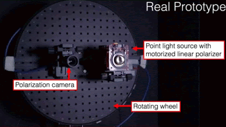
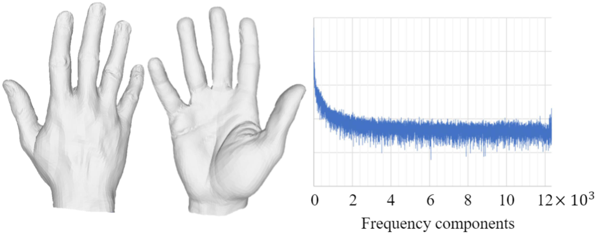
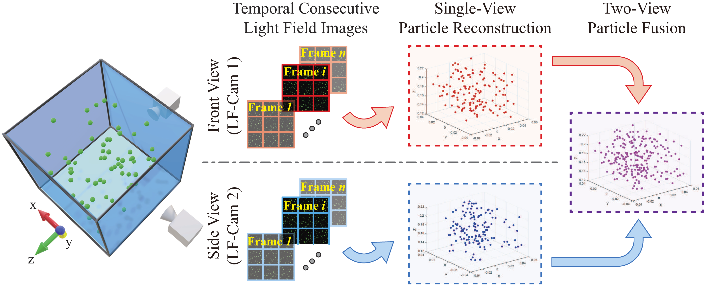
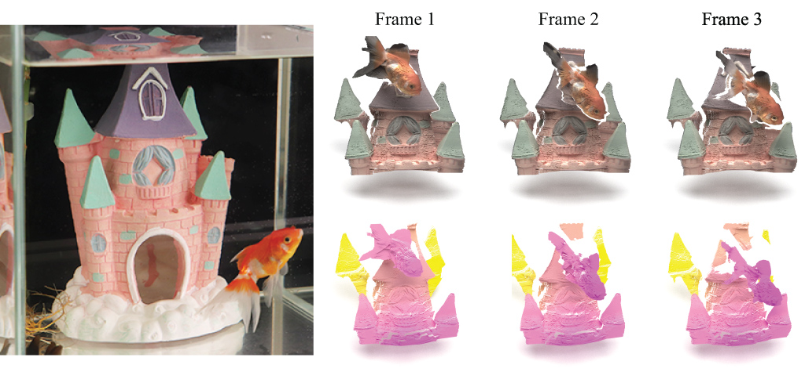
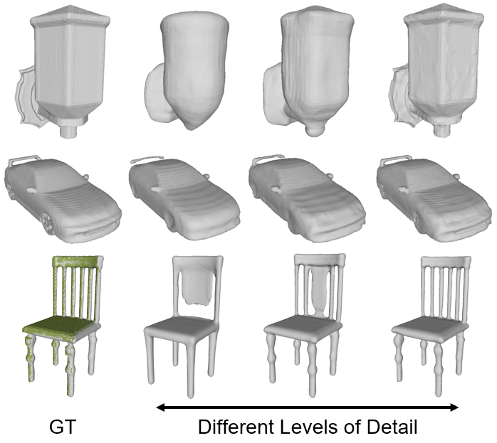
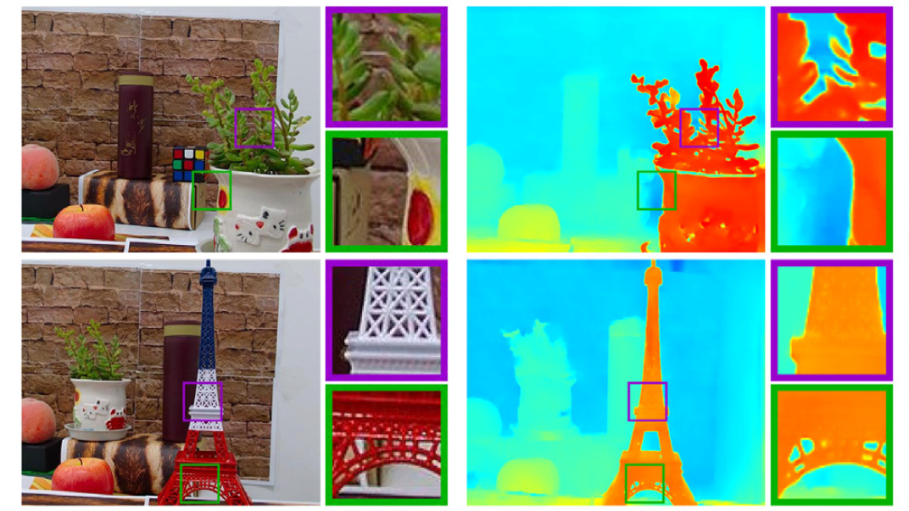
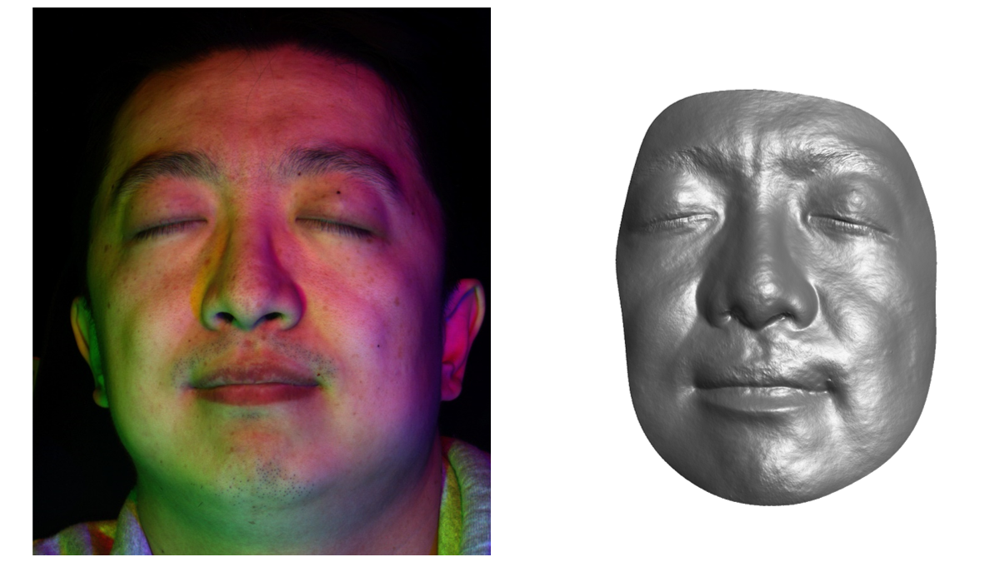
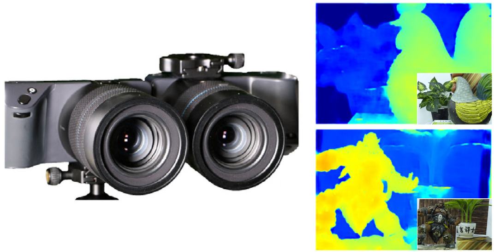
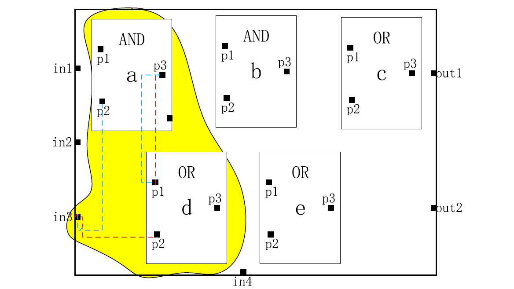
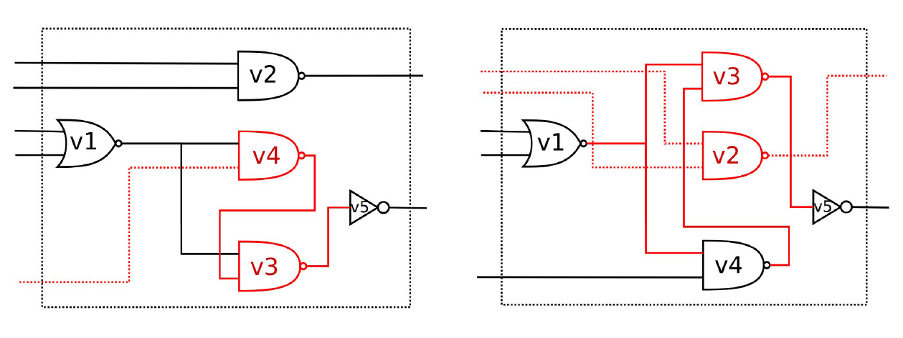

<!-- <link href="../assets/css/bootstrap.min.css" rel="stylesheet"> -->
<link href="../assets/css/bootstrap_custom.css" rel="stylesheet">

I am currently a <b>Senior Research Engineer/Scientist</b> at [InnoPeak Technology](https://www.innopeaktech.com/) (a.k.a. OPPO US Research Center), working on R&D for XR (AR/VR/MR) related projects. Before that, I was a visiting research scholar at Louisiana State University, where I worked with Dr. Jinwei Ye. I received my Ph.D. from [ShanghaiTech University](https://www.shanghaitech.edu.cn/eng/), advised by [Prof. Jingyi Yu](https://vic.shanghaitech.edu.cn/vrvc/en/people/jingyi-yu/), and received my Bachelor's degree from [Shanghai Jiao Tong University](https://en.sjtu.edu.cn/). My research interests lie in computer vision, deep learning, computer graphics, and computational photography, with a focus on neural rendering, implicit neural representation, and 3D reconstruction.

Download CV from [here](https://zhangchen8.github.io//files/CV_ZhangChen.pdf).

Publications <small>(*Equal contribution, &dagger;corresponding author)</small>
------

    

        
    

    

        

            Spacetime Gaussian Feature Splatting for Real-Time Dynamic View Synthesis
        

        

            Zhan Li, <b>Zhang Chen</b><b>&dagger;</b>, Zhong Li<b>&dagger;</b>, Yi Xu
        

        

            <b>CVPR 2024</b>
        

        

            <a href="https://arxiv.org/pdf/2312.16812.pdf">[paper]</a>
            <a href="https://oppo-us-research.github.io/SpacetimeGaussians-website/">[project page]</a>
            <a href="https://github.com/oppo-us-research/SpacetimeGaussians">[code]</a>
        

    

    

        
    

    

        

            Polarimetric Helmholtz Stereopsis
        

        

            Yuqi Ding, Yu Ji, <b>Zhang Chen</b>, Mingyuan Zhou, Sing Bing Kang, Jinwei Ye
        

        

            <b>TPAMI 2024</b>
        

        

            <a href="https://www.computer.org/csdl/journal/tp/5555/01/10414400/1TZIH27x2xi">[paper]</a>
        

    

    

        <video width="100%" playsinline="" autoplay="" loop="" preload="" muted="">
            <source src="../images/2023_neurbf.mp4" type="video/mp4">
        </video>
    

    

        

            NeuRBF: A Neural Fields Representation with Adaptive Radial Basis Functions
        

        

            <b>Zhang Chen</b><b>&dagger;</b>, Zhong Li<b>&dagger;</b>, Liangchen Song, Lele Chen, Jingyi Yu, Junsong Yuan, Yi Xu
        

        

            <b>ICCV 2023 (Oral)</b>
        

        

            <a href="https://arxiv.org/pdf/2309.15426.pdf">[paper]</a>
            <a href="https://oppo-us-research.github.io/NeuRBF-website/">[project page]</a>
            <a href="https://github.com/oppo-us-research/NeuRBF">[code]</a>
        

    

    

        
    

    

        

            Relit-NeuLF: Efficient Relighting and Novel View Synthesis via Neural 4D Light Field
        

        

            Zhong Li, Liangchen Song, <b>Zhang Chen</b>, Xiangyu Du, Lele Chen, Junsong Yuan, Yi Xu
        

        

            <b>ACM MM 2023</b>
        

        

            <a href="https://arxiv.org/pdf/2310.14642.pdf">[paper]</a>
            <a href="https://oppo-us-research.github.io/RelitNeuLF-website/">[project page]</a>
            <a href="https://github.com/oppo-us-research/RelitNeuLF">[code]</a>
        

    

    

        
    

    

        

            High Fidelity 3D Hand Shape Reconstruction via Scalable Graph Frequency Decomposition
        

        

            Tianyu Luan, Yuanhao Zhai, Jingjing Meng, Zhong Li, <b>Zhang Chen</b>, Yi Xu, Junsong Yuan
        

        

            <b>CVPR 2023</b>
        

        

            <a href="https://cse.buffalo.edu/~jsyuan/papers/2023/6034_high_fidelity_3d_hand_shape_re-Camera-ready%20PDF.pdf">[paper]</a>
        

    

    

        <video width="100%" playsinline="" autoplay="" loop="" preload="" muted="">
            <source src="../images/2023_nerfplayer.mp4" type="video/mp4">
        </video>
    

    

        

            NeRFPlayer: A Streamable Dynamic Scene Representation with Decomposed Neural Radiance Fields
        

        

            Liangchen Song, Anpei Chen, Zhong Li, <b>Zhang Chen</b>, Lele Chen, Junsong Yuan, Yi Xu, Andreas Geiger
        

        

            <b>TVCG (IEEE VR) 2023</b>
        

        

            <a href="https://arxiv.org/pdf/2210.15947.pdf">[paper]</a>
            <a href="https://lsongx.github.io/projects/nerfplayer.html">[project page]</a>
        

    

    

        
    

    

        

            Full-Volume 3D Fluid Flow Reconstruction with Light Field PIV
        

        

            Yuqi Ding, Zhong Li, <b>Zhang Chen</b>, Yu Ji, Jingyi Yu, Jinwei Ye
        

        

            <b>TPAMI 2023</b>
        

        

            <a href="https://ieeexplore.ieee.org/document/10015628">[paper]</a>
            <a href="https://lightfieldpiv.github.io/">[project page]</a>
        

    

    

        
    

    

        

            Light Field-Based Underwater 3D Reconstruction via Angular Resampling
        

        

            Yuqi Ding, <b>Zhang Chen</b>, Yu Ji, Jingyi Yu, Jinwei Ye
        

        

            <b>TCI 2023</b>
        

        

            <a href="https://ieeexplore.ieee.org/abstract/document/10265154">[paper]</a>
        

    

    

        <video width="100%" playsinline="" autoplay="" loop="" preload="" muted="">
            <source src="../images/2022_sofgan.mp4" type="video/mp4">
        </video>
    

    

        

            SofGAN: A Portrait Image Generator with Dynamic Styling
        

        

            Anpei Chen<b>*</b>, Ruiyang Liu<b>*</b>, Ling Xie, <b>Zhang Chen</b>, Hao Su, Jingyi Yu
        

        

            <b>TOG 2022 (Present at SIGGRAPH 2022)</b>
        

        

            <a href="https://arxiv.org/pdf/2007.03780">[paper]</a>
            <a href="https://apchenstu.github.io/sofgan/">[project page]</a>
            <a href="https://github.com/apchenstu/sofgan">[code]</a>
        

    

    

        
    

    

        

            Multiresolution Deep Implicit Functions for 3D Shape Representation
        

        

            <b>Zhang Chen</b>, Yinda Zhang, Kyle Genova, Sean Fanello, Sofien Bouaziz, Christian Haene, Ruofei Du, Cem Keskin, Thomas Funkhouser, Danhang Tang
        

        

            <b>ICCV 2021</b>
        

        

            <a href="https://arxiv.org/pdf/2109.05591">[paper]</a>
        

    

    

        
    

    

        

            Deep Eyes: Joint Depth Inference Using Monocular and Binocular Cues
        

        

            <b>Zhang Chen</b><b>*</b>, Xinqing Guo<b>*</b>, Siyuan Li, Yang Yang, Jingyi Yu
        

        

            <b>Neurocomputing 2021</b>
        

        

            <a href="https://www.sciencedirect.com/science/article/abs/pii/S0925231220313746">[paper]</a>
            <a href="https://github.com/LansburyCH/Binocular-Focal-Stack">[data]</a>
        

    

    

        <video width="100%" playsinline="" autoplay="" loop="" preload="" muted="">
            <source src="../images/2020_rnr.mp4" type="video/mp4">
        </video>
    

    

        

            A Neural Rendering Framework for Free-Viewpoint Relighting
        

        

            <b>Zhang Chen</b>, Anpei Chen, Guli Zhang, Chengyuan Wang, Yu Ji, Kiriakos N. Kutulakos, Jingyi Yu
        

        

            <b>CVPR 2020</b>
        

        

            <a href="https://arxiv.org/pdf/1911.11530">[paper]</a>
            <a href="https://github.com/LansburyCH/relightable-nr">[code]</a>
        

    

    

        
    

    

        

            3D Face Reconstruction Using Color Photometric Stereo with Uncalibrated Near Point Lights
        

        

            <b>Zhang Chen</b>, Yu Ji, Mingyuan Zhou, Sing Bing Kang, Jingyi Yu
        

        

            <b>ICCP 2020</b>
        

        

            <a href="https://arxiv.org/pdf/1904.02605">[paper]</a>
        

    

    

        
    

    

        

            Photo-Realistic Facial Details Synthesis From Single Image
        

        

            Anpei Chen, <b>Zhang Chen</b>, Guli Zhang, Ziheng Zhang, Kenny Mitchell, Jingyi Yu
        

        

            <b>ICCV 2019 (Oral)</b>
        

        

            <a href="https://openaccess.thecvf.com/content_ICCV_2019/papers/Chen_Photo-Realistic_Facial_Details_Synthesis_From_Single_Image_ICCV_2019_paper.pdf">[paper]</a>
            <a href="https://apchenstu.github.io/facial_details/">[project page]</a>
            <a href="https://github.com/apchenstu/Facial_Details_Synthesis">[code]</a>
        

    

    

        
    

    

        

            Deep Eyes: Binocular Depth-from-Focus on Focal Stack Pairs
        

        

            Xinqing Guo<b>*</b>, <b>Zhang Chen</b><b>*</b>, Siyuan Li, Yang Yang, Jingyi Yu
        

        

            <b>PRCV 2019 (Oral)</b>
        

        

            <a href="https://link.springer.com/chapter/10.1007/978-3-030-31726-3_30">[paper]</a>
        

    

    

        <video width="100%" playsinline="" autoplay="" loop="" preload="" muted="">
            <source src="../images/2018_wps.mp4" type="video/mp4">
        </video>
    

    

        

            Sparse Photometric 3D Face Reconstruction Guided by Morphable Models
        

        

            Xuan Cao, <b>Zhang Chen</b>, Anpei Chen, Xin Chen, Shiying Li, Jingyi Yu
        

        

            <b>CVPR 2018</b>
        

        

            <a href="https://openaccess.thecvf.com/content_cvpr_2018/papers/Cao_Sparse_Photometric_3D_CVPR_2018_paper.pdf">[paper]</a>
        

    

    

        
    

    

        

            How Secure Is Split Manufacturing in Preventing Hardware Trojan?
        

        

            Yajun Yang, <b>Zhang Chen</b>, Yuan Liu, Tsung-Yi Ho, Yier Jin, Pingqiang Zhou
        

        

            <b>TODAES 2020</b>
        

        

            <a href="https://dl.acm.org/doi/abs/10.1145/3378163?casa_token=9zKcVtAW6l8AAAAA:mIx-ADc4LRaDiCU4q3jRPHDgqVOfB--UmAVUnhPJ3DddfE2_aeF4TjQZ29piSUcQy3EAOf8PWD3QIQ">[paper]</a>
        

    

    

        
    

    

        

            How Secure Is Split Manufacturing in Preventing Hardware Trojan?
        

        

            <b>Zhang Chen</b>, Pingqiang Zhou, Tsung-Yi Ho, Yier Jin
        

        

            <b>AsianHOST 2016</b>
        

        

            <a href="https://ieeexplore.ieee.org/abstract/document/7835561">[paper]</a>
        

    

<!-- {: .align-left}
jgklfdjlsfhghldfhlsdfjlk
{:style="clear: left"} -->

<!-- 
  
 -->
